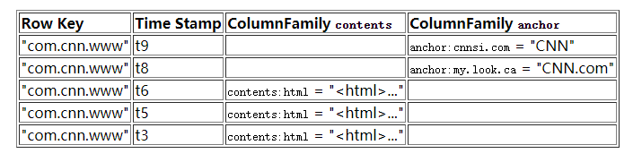
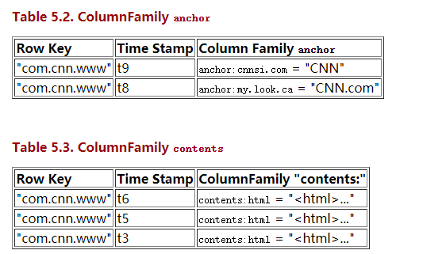

# Hbase单机安装

- [下载安装包](http://apache.forsale.plus/hbase/2.3.1/hbase-2.3.1-bin.tar.gz)
- 解压

```shell script
tar -zxvf hbase-2.3.1-bin.tar.gz
```

- 修改配置文件

```shell script
vim conf/hbase-site.xml 
```

修改配置如下

```xml
<?xml version="1.0"?>
<?xml-stylesheet type="text/xsl" href="configuration.xsl"?>
<!--
/*
 * Licensed to the Apache Software Foundation (ASF) under one
 * or more contributor license agreements.  See the NOTICE file
 * distributed with this work for additional information
 * regarding copyright ownership.  The ASF licenses this file
 * to you under the Apache License, Version 2.0 (the
 * "License"); you may not use this file except in compliance
 * with the License.  You may obtain a copy of the License at
 *
 *     http://www.apache.org/licenses/LICENSE-2.0
 *
 * Unless required by applicable law or agreed to in writing, software
 * distributed under the License is distributed on an "AS IS" BASIS,
 * WITHOUT WARRANTIES OR CONDITIONS OF ANY KIND, either express or implied.
 * See the License for the specific language governing permissions and
 * limitations under the License.
 */
-->
<configuration>
  <!--
    The following properties are set for running HBase as a single process on a
    developer workstation. With this configuration, HBase is running in
    "stand-alone" mode and without a distributed file system. In this mode, and
    without further configuration, HBase and ZooKeeper data are stored on the
    local filesystem, in a path under the value configured for `hbase.tmp.dir`.
    This value is overridden from its default value of `/tmp` because many
    systems clean `/tmp` on a regular basis. Instead, it points to a path within
    this HBase installation directory.

    Running against the `LocalFileSystem`, as opposed to a distributed
    filesystem, runs the risk of data integrity issues and data loss. Normally
    HBase will refuse to run in such an environment. Setting
    `hbase.unsafe.stream.capability.enforce` to `false` overrides this behavior,
    permitting operation. This configuration is for the developer workstation
    only and __should not be used in production!__

    See also https://hbase.apache.org/book.html#standalone_dist
  -->
  <property>
    <name>hbase.cluster.distributed</name>
    <value>false</value>
  </property>
  <property>
    <name>hbase.tmp.dir</name>
    <value>/mydata/Hbase</value>
  </property>
  <property>
    <name>hbase.unsafe.stream.capability.enforce</name>
    <value>false</value>
  </property>
</configuration>

```

**主要修改存储路径**

- 运行Hbase并进入shell命令界面

```shell script
./bin/start-hbase.sh 
```
运行成功，会出现下面的信息
```
running master, logging to /root/HBase/hbase-2.3.1/bin/../logs/hbase-root-master-localhost.localdomain.out
```

```shell script
./bin/hbase shell
```

- 停止Hbase

```shell script
./bin/stop-hbase.sh
stopping hbase...............
```


# 数据类型

- 概念模型
    - 列名：一个列名是由它的列族前缀和修饰符(qualifier)连接而成。例如列contents:html是列族 contents加冒号(:)加 修饰符 html组成的。
    - 视图
    
    

- 物理模型
    - 物理视图
    
       在物理视图中，列族是区分存储的。
       
       
       
- 表

  在schema声明的时候定义

- 行键

  - 不可分割的字节数组
  - 按字典排序由低到高存储在表中
  - 空的数组是用来标识表空间的起始或者结尾

- 列族
  - 格式：ourses:history 和 courses:math都是列族，courses的成员.冒号(:)是列族的分隔符
  - 一个列族的所有列成员都有相同的前缀
  - 列族前缀必须是可打印的字符，剩下的部分(称为qualify),可以由任意字节数组组成
  - 列族必须在表建立的时候声明
  - 在物理上，一个的列族成员在文件系统上都是存储在一起。因为存储优化都是针对列族级别的，这就意味着，一个colimn family的所有成员的是用相同的方式访问的。

- cells
  - {row, column, version} 元组就是一个HBase中的一个 cell。Cell的内容是不可分割的字节数组。
  
- 基本操作
  - Get
  - Put
  - Scan
  - Delete
  
- 排序

  Hbase对于基本操作的结果是按照行、列族、修饰符和时间戳依次排列。     
  

       
     


